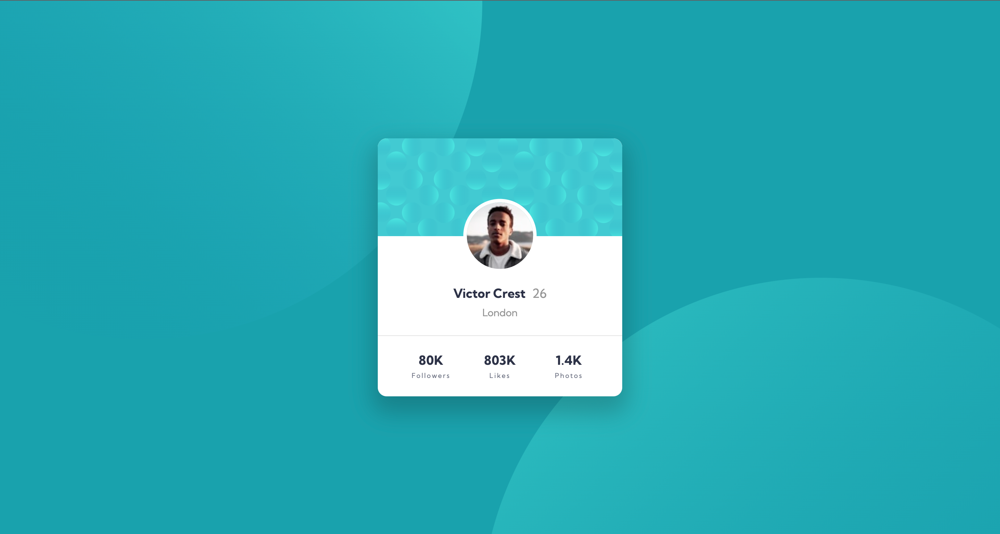

# Frontend Mentor - Profile card component solution

This is a solution to the [Profile card component challenge on Frontend Mentor](https://www.frontendmentor.io/challenges/profile-card-component-cfArpWshJ). Frontend Mentor challenges help you improve your coding skills by building realistic projects.

## Table of contents

- [Overview](#overview)
  - [The challenge](#the-challenge)
  - [Screenshot](#screenshot)
  - [Links](#links)
- [My process](#my-process)
  - [Built with](#built-with)
  - [What I learned](#what-i-learned)
  - [Continued development](#continued-development)
  - [Useful resources](#useful-resources)
- [Author](#author)

## Overview

### The challenge

- Build out the project to the designs provided

### Screenshot



### Links

- Solution URL: [Add solution URL here](https://your-solution-url.com)
- Live Site URL: [Add live site URL here](https://your-live-site-url.com)

## My process

### Built with

- Semantic HTML5 markup
- CSS custom properties
- Flexbox
- CSS Grid
- Desktop-first workflow

### What I learned

I learned how to use more than one image to create a background. In order to place the two circular shaped images in the places they needed to be even when the screen size changed, I used absolute positioning.

```html
<body>
  <main>
    
    
  </main>
</body>
```

```css
/* Background */
.bg-top {
  position: absolute;
  top: -185%;
  left: -235%;
}

.bg-bottom {
  position: absolute;
  bottom: -217%;
  right: -220%;
}
```

### Continued development

I initally wanted to use background-image proprty in CSS to make the background. I wasn't able to do it, since the images' position kept on changing depending on the screen size.

However, I was still able to learn some new background properties and values in the process of figuring things out.

I learned about differenet values of background-position.

### Useful resources

- [MDN Web Docs](https://developer.mozilla.org/en-US/docs/Web/CSS/background-position) - background-position and different values that can be used.
- [MDN Web Docs](https://developer.mozilla.org/en-US/docs/Web/CSS/background-attachment) - background-attachment has values like scroll, fixed, and local.

## Author

- Frontend Mentor - [@kongguksu](https://www.frontendmentor.io/profile/kongguksu)
- Twitter - [@sooj2050](https://www.twitter.com/sooj2050)
